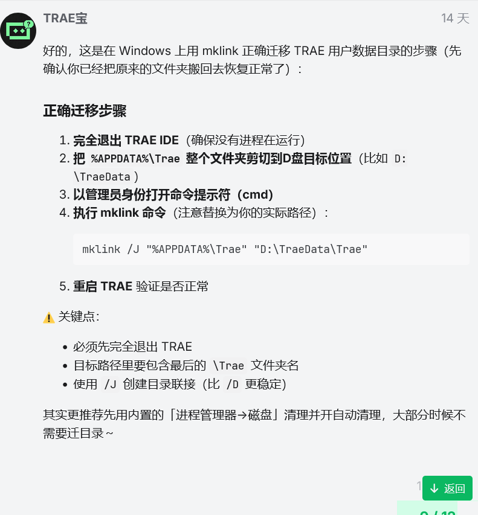

# TraeCleaner

将官方提供的 Trae C盘空间占用问题，总结成了 Skill。

## 在使用trae编码时，是不是会不断的占用C盘空间？
在 Windows 上用 mklink 正确迁移 TRAE 用户数据目录的步骤（先确认你已经把原来的文件夹搬回去恢复正常了）：
正确迁移步骤

    完全退出 TRAE IDE（确保没有进程在运行）
    把 %APPDATA%\Trae 整个文件夹剪切到D盘目标位置（比如 D:\TraeData）
    以管理员身份打开命令提示符（cmd）
    执行 mklink 命令（注意替换为你的实际路径）：

    mklink /J "%APPDATA%\Trae" "D:\TraeData\Trae"

    重启 TRAE 验证是否正常

:warning: 关键点：

    必须先完全退出 TRAE
    目标路径里要包含最后的 \Trae 文件夹名
    使用 /J 创建目录联接（比 /D 更稳定）

其实更推荐先用内置的「进程管理器→磁盘」清理并开自动清理，大部分时候不需要迁目录～

ref:

